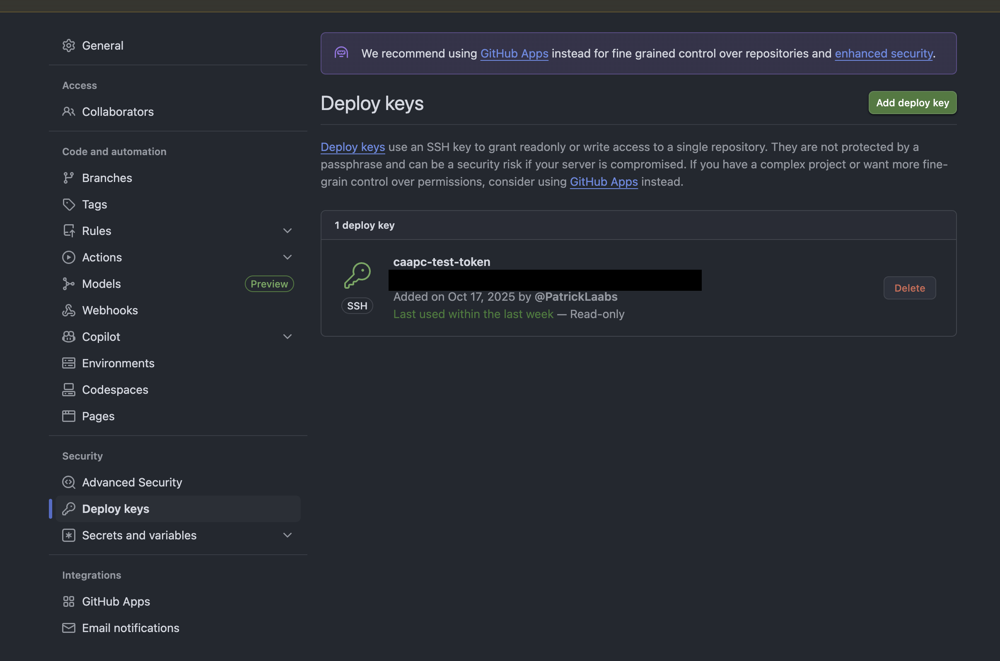

# Prepare your deployment Repository

In order to pull from your private Repository, you either need a valid
SSH-Token, or a valid PAT (persoal access token).

These shall be configured in your Repositories settings.

