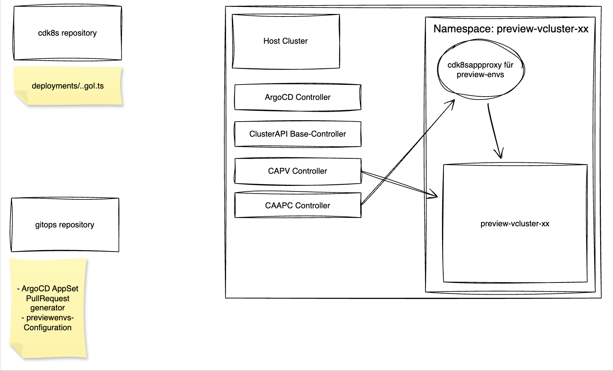

# Creating your first preview-environment

When you create a pull request on your deployment repository, the argoCD PullRequest generator will start the creation of the vcluster, and the cdk8sappproxy resource. 

## High-Level overview

